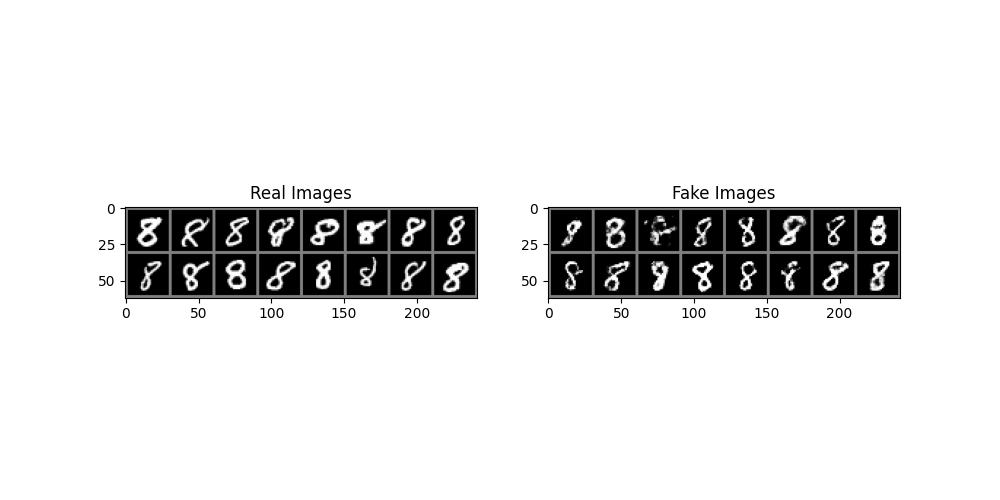

WGAN for MNIST Digit Generation

This repository contains the code for a Wasserstein Generative Adversarial Network (WGAN), designed to generate MNIST digits.
Introduction

A WGAN is a type of GAN that uses a different loss function to improve the stability of its training process. 

The main components of this repository are:

<ul>
    <li><code>main.py</code>: Main driver script that trains the WGAN and generates MNIST digits.</li>
    <li><code>wGAN.py</code>: Holds the code for the Neural Networks.</li>
    <li><code>OpenData.py</code>: Contains the DataLoaderCreator class for loading and transforming the MNIST dataset.</li>
    <li><code>PlottingFx.py</code>: Contains methods for plotting generator and critic losses, and for displaying and saving real and fake images.</li>
</ul>

<h2>Generator and Critic Losses</h2>

    The following plot illustrates the generator and critic losses during the training of the Wasserstein GAN. The x-axis represents the iterations, and the y-axis represents the loss.

<h2>Real and Fake Data Display</h2>

    Below, we compare the real MNIST digits (left) with the digits generated by our trained WGAN (right).

